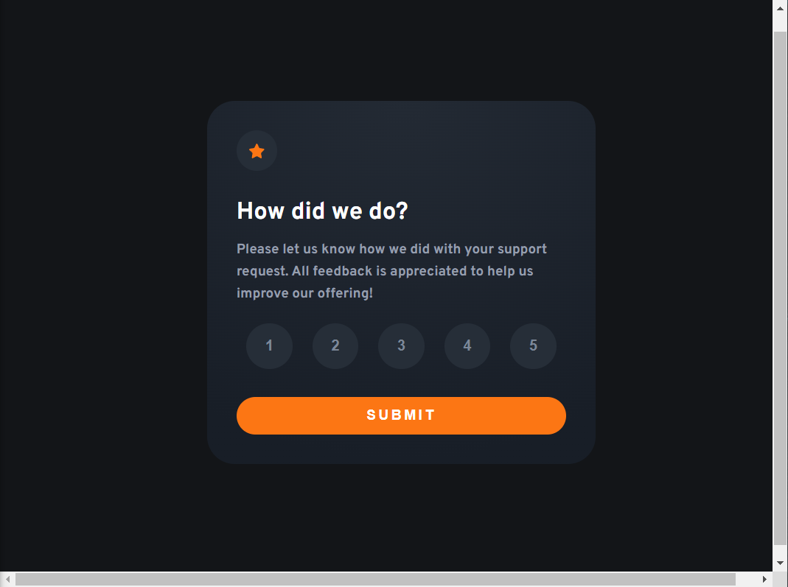
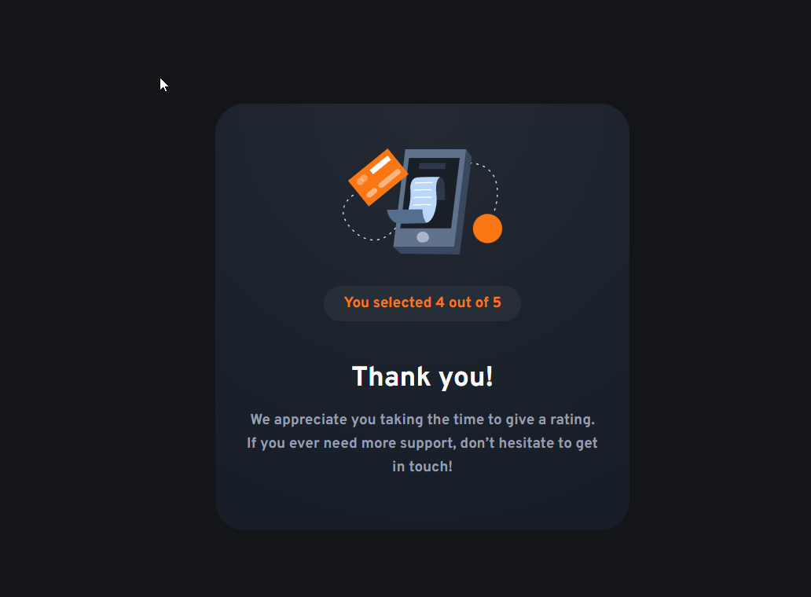

# Frontend Mentor - Interactive rating component solution

This is a solution to the [Interactive rating component challenge on Frontend Mentor](https://www.frontendmentor.io/challenges/interactive-rating-component-koxpeBUmI).

## Overview

### The challenge

Users should be able to:

- View the optimal layout for the app depending on their device's screen size
- See hover states for all interactive elements on the page
- Select and submit a number rating
- See the "Thank you" card state after submitting a rating

### Screenshot (before rating)

### Screenshot (after rating)

### Links

- Solution Code: [Github Repo](https://github.com/waldrupm/FEM-interactive-rating-component)
- Solution Site: [Github Pages](https://waldrupm.github.io/FEM-interactive-rating-component/)

## My process

### Built with

- Semantic HTML5 markup
- CSS custom properties
- Flexbox

### What I learned

- I learned that HTMLCollections aren't iterable in the same way arrays are in JS.
- I also learned a unique way to make radio buttons visually appealing. I'm not sure how accessible it is though. If I were going to deploy this to something people actually use, I'd spend some time making sure it was accessible.

### Continued development

I enjoyed just using vanilla JS for this rather than setting up tooling and a build process with something like React.

## Author

Micheal Waldrup [Github](https://github.com/waldrupm)

## Acknowledgments

This was pretty fun. I'm looking forward to doing more FrontendMentor projects in the next 100 days!
